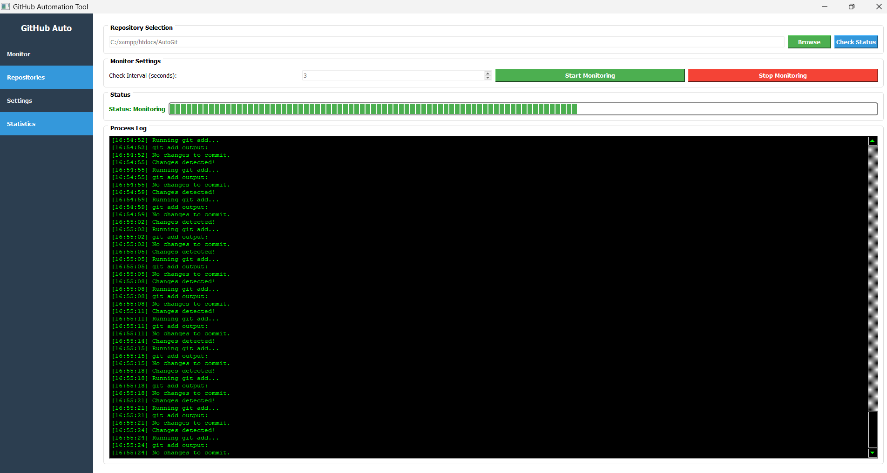
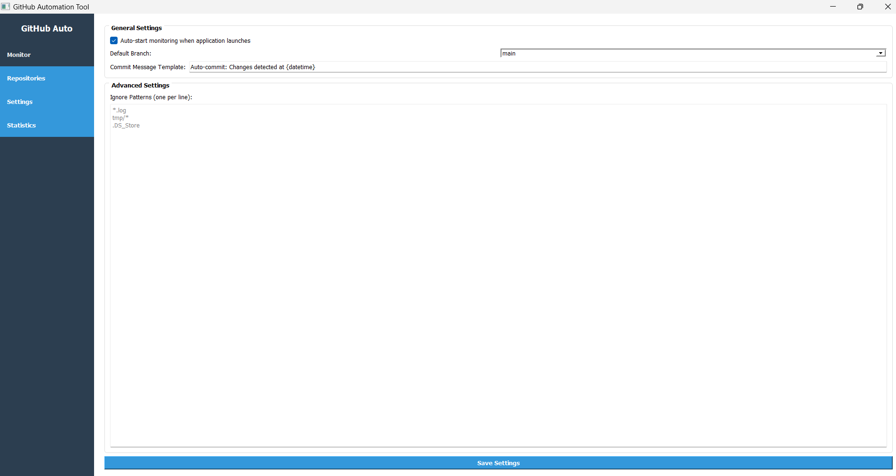
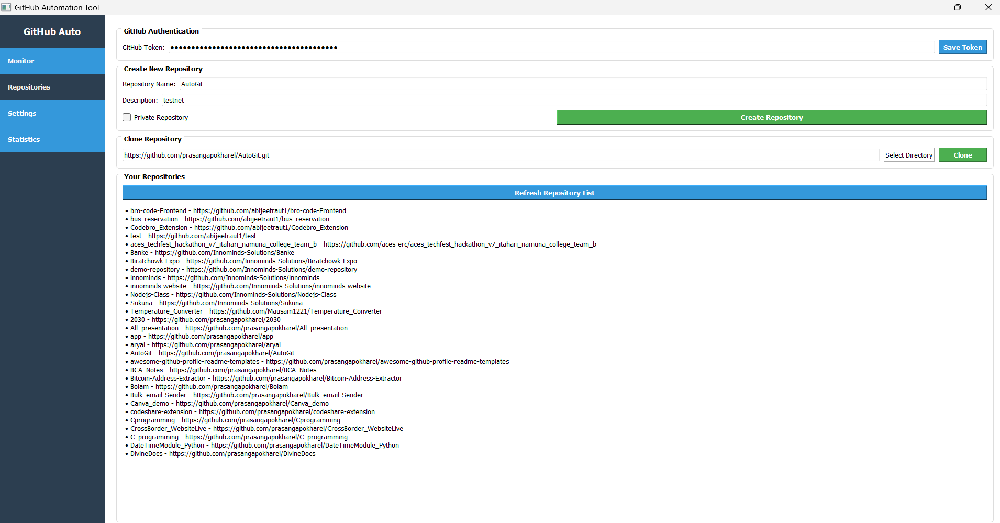

# AutoGit

AutoGit is a powerful GitHub automation tool that helps you monitor repositories, automatically commit and push changes, and manage your GitHub repositories with ease.

## Screenshots

### Monitor Tab

*Monitor your repositories and automatically commit changes*

### Repository Management

*Create, clone, and manage your GitHub repositories*

### Statistics View

*View commit history and repository statistics*

## Features

- **Automatic Git Operations**: Monitors your repository for changes and automatically commits and pushes them
- **Repository Initialization**: Initialize new Git repositories with default .gitignore and README
- **GitHub Integration**: Create, list, and clone repositories directly from the application
- **Modern UI**: Intuitive sidebar-based interface for easy navigation
- **Commit History**: View detailed commit history and statistics
- **Customizable Settings**: Configure commit messages, ignore patterns, and more

## Installation

### Prerequisites

- Python 3.7 or higher
- Git installed and configured on your system
- GitHub account and personal access token (for GitHub API features)

### Step 1: Clone the repository

```bash
git clone https://github.com/prasangapokharel/AutoGit
cd autogit